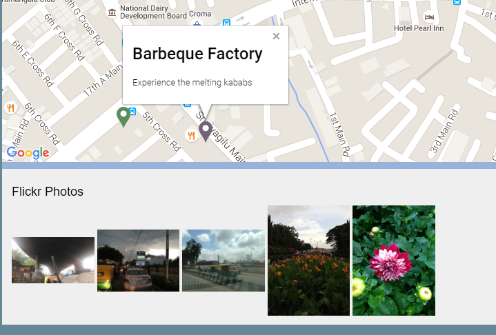

# HackathonApp #
Neighborhood map project is developed for Front-End Nanodegree at Udacity. This project is built using Google Maps API and knockoutjs framework. Features Include: A full-screen map to page using the Google Maps API. Search bar functionality. Flickr images based on location coordinates

